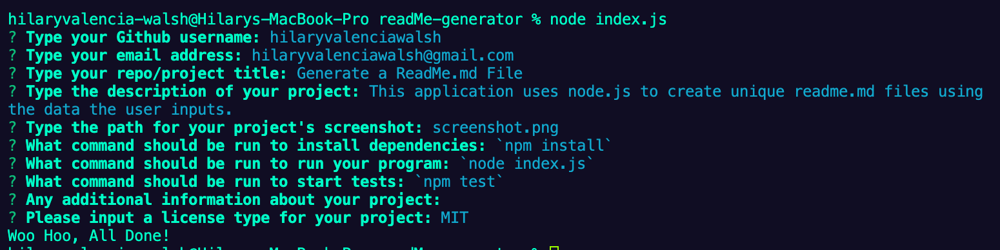

[contributors-shield]: https://img.shields.io/github/contributors/hilaryvalenciawalsh/readMe-generator.svg?style=flat-square
[contributors-url]: https://github.com/hilaryvalenciawalsh/readMe-generator/graphs/contributors
[forks-shield]: https://img.shields.io/github/forks/hilaryvalenciawalsh/readMe-generator.svg?style=flat-square
[forks-url]: https://github.com/hilaryvalenciawalsh/readMe-generator/network/members
[stars-shield]: https://img.shields.io/github/stars/hilaryvalenciawalsh/readMe-generator.svg?style=flat-square
[stars-url]: https://github.com/hilaryvalenciawalsh/readMe-generator/stargazers
[issues-shield]: https://img.shields.io/github/issues/hilaryvalenciawalsh/readMe-generator.svg?style=flat-square
[issues-url]: https://github.com/hilaryvalenciawalsh/readMe-generator/issues
[license-shield]: https://img.shields.io/github/license/hilaryvalenciawalsh/readMe-generator.svg?style=flat-square
[license-url]: https://github.com/hilaryvalenciawalsh/readMe-generator/blob/master/license.txt
[![Contributors][contributors-shield]][contributors-url] [![Forks][forks-shield]][forks-url] [![Stargazers][stars-shield]][stars-url] [![Issues][issues-shield]][issues-url] [![license.txt][license-shield]][license-url]
# readMe-generator

## Description
This is a README generator that uses node.js to create unique readme files based on user inputted information.

## Table of Contents
- [Title](#title)
- [Description](#description)
- [Table of Contents](#table-of-contents)
- [Screenshots](#screenshots)
- [Installation](#installation)
- [Usage](#usage)
- [Testing](#testing)
- [Additional Information](#additional-information)
- [License](#license)
- [Contributing](#contributing)
- [Questions](#questions)

## Screenshots

## Installation
Download or clone the repo, then use a CLI and run the `npm install` command.

## Usage
Run the application with the CLI command `node index.js` and follow the prompts.

## Testing
Run the tests using the CLI command `npm test`.

## Additional Information

## License
This project is licensed under the MIT License - see the [license.txt](https://github.com/hilaryvalenciawalsh/readMe-generator/blob/master/license.txt) file for details

## Contributing
This is the code of conduct, and the process for pull requests.

## Questions
Please contact me using one of the following:

- Github: [hilaryvalenciawalsh](https://gist.github.com/hilaryvalenciawalsh)   

- Email: hilaryvalenciawalsh@gmail.com;
